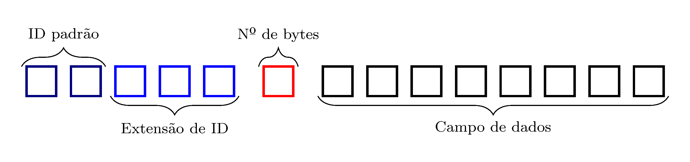
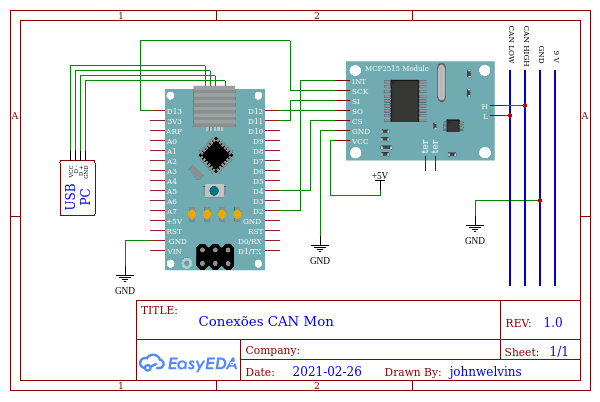
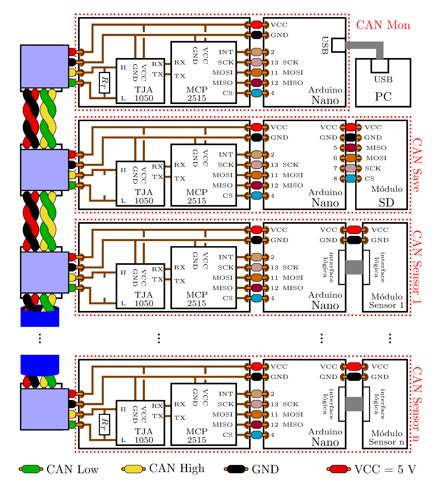

# MCP2515 (em contrução)

 >John Welvins Barros de Araujo¹   
 >Prof. Fabricio Ferrari¹   
 >Prof. Edson M. Kakuno²   

¹ [IMEF](https://imef.furg.br/) - Universidade Federal do Rio Grande   
² [Física](http://cursos.unipampa.edu.br/cursos/licenciaturaemfisica/) - Unipampa Bagé   

A biblioteca MCP2515 foi feita para auxiliar/facilitar o controle do CI da Microchip, de mesmo nome, por plataformas Arduino, ou compatíveis. As funções de configuração possuem valores padrão, de modo a fornecer uma configuração simples e rápida. O CI MCP2515 configurado no modo padrão dessa biblioteca estará preparado para operar em uma rede de 125 k bit/s, sem a implementação de filtros de aceite nos buffers de entrada, com rollover do buffer de saída RXB0 para o RXB1, e além disso são habilitadas interrupções que indicam o sucesso de recebimento e envio. Para setar outra configuração o usuário deverá atualizar os valores das [variáveis de configuração](#varpubs_conf), e em seguida executar a função correspondente aos registros modificados, como a [confMode()](#confMode), [confRX()](#confRX), [confTX()](#confTX), [confINT()](#confINT), [confFM()](#confFM) e [confCAN()](#confCAN). Ou ainda as usando as funções de escrita básica, [write (REG, VAL, CHECK = 1)](#write) e [bitModify (REG, MASK, VAL, check = 0)](#bitModify).

Os frames podem ser escritos no barramento com a função [writeFrame(frameToSend, txb\_ = 0, timeOut = 10, check = 0)](#writeFrame) e podem ser lidos pela função [readFrame ()](#readFrame) que atualiza os valores dos frames internos [frameRXB0](#frameRXB0) e [frameRXB1](#frameRXB1).
As informações da mensagem são armazenadas na estrutura apresentada na figura [Frame](#frame), e podem ser acessados com as [variáveis do frame](#frames_var).
Também é possível obter os dados acessando diretamente os registros correspondentes aos buffers de entrada do MCP2515 com a função [read(REG, data, n = 1)](#read).
De forma análoga pode-se escrever nos buffers de saída do MCP2515 e solicitar o envio usando as funções de escrita básicas.

A principal referência desta biblioteca é o datasheet [MCP2515 Stand-Alone CAN Controller with SPI Interface](http://ww1.microchip.com/downloads/en/DeviceDoc/MCP2515-Stand-Alone-CAN-Controller-with-SPI-20001801J.pdf).
Por questões de comodidade muitos dos códigos numéricos relacionados a comunicação do MCP2515 com a plataforma Arduino foram expressos em hexadecimal indicado por 0x, e quando não estarão em decimal.

Um exemplo de conexão com um Arduino Nano e um módulo CAN, o MCP2515 e o transceptor [TJA1050](https://www.nxp.com/docs/en/data-sheet/TJA1050.pdf) da Phillips, pode ser visto na figura [Conexão](#MCPxNano).

 

O barramento é composto por pelo menos dois dispositivos, na figura [Bus](#bus) pode-se ver um diagrama simplificado de um barramento CAN.

São fornecidos 6 exemplos de rotinas, dois para transmissão [CANTX.ino](https://github.com/KakiArduino/MCP2515/blob/version_1/example/CANTX/CANTX.ino) e [CANTXshort](https://github.com/KakiArduino/MCP2515/blob/version_1/example/CANTXshort/CANTXshort.ino), um para recepção [CANRX.ino](https://github.com/KakiArduino/MCP2515/blob/version_1/example/CANRX/CANRX.ino), dois exemplos de nodos sink (receptores), o [CANMon.ino](https://github.com/KakiArduino/MCP2515/tree/version_1/example/CANMon) envia para as mensagens para um computador pela porta USB-Serial, e o [CANSave.ino](https://github.com/KakiArduino/MCP2515/tree/version_1/example/CANSave) que salvas as mensagens recebidas em um cartão SD usando SPI via software.
Também é fornecido um template para nodos sensores, o exemplo [CANSensor.ino](https://github.com/KakiArduino/MCP2515/tree/version_1/example/CANSensor).

*******
Sumário:
 1. [Variáveis de um frame](#frames_var)   
 2. [Declaração de frames](#frames_fun)
 3. [Variaives publicas](#MCP_var)
 3.1 [SPI](#MCP_var_SPI)
 3.2 [Configurações gerais do MCP2515](#MCP_var_conf)
 3.3 [Filtros e Mascaras](#MCP_var_filMask)
 3.4 [Erros](#MCP_var_erros)
 3.5 [Frames](#MCP_var_frm)
 4. [Funções publicas](#MCP_fun)

*******

  
## Variáveis de um frame

 

 
## Declaração de frames

  
## Variaives publicas

  
### SPI

  
### Configurações gerais do MCP2515

  
### Filtros e Mascaras

  
### Erros

  
### Frames

  
## Funções publicas
